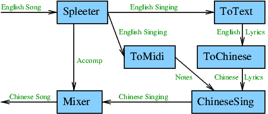
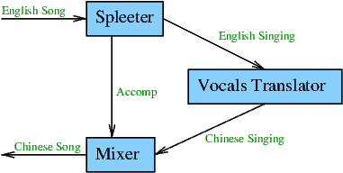

# English to Chinese Song Experiment

Experiments to compose AI services.  The AI service composition under
study is the the English to Chinese song converter.  That is the
composition takes an English song in input, and outputs the same song
sung in Chinese.  See the graphical representation of the AI service
composition below.

- [english-to-chinese-song-xp.metta](english-to-chinese-song-xp.metta):
  Experiment to type check an actual AI service combination.  Most
  services, with the exception of ToMidi and Mixer, are obtained from
  the SingularityNET marketplace, including their data types and
  methods alongside their type signature.

- [english-to-chinese-song-simple-ontology-xp.metta](english-to-chinese-song-simple-ontology-xp.metta):
  Same as
  [english-to-chinese-song-xp.metta](english-to-chinese-song-xp.metta)
  but simplifies the AI service methods by avoid data contructors when
  possible, and introduces a simple ontology, one level deep subtyping
  relation such as `(<: Audio Bytes)`.  In this experience the
  ontology is sufficiently simple that no type coercion is required.

- [english-to-chinese-song-moderate-ontology-xp.metta](english-to-chinese-song-moderate-ontology-xp.metta):
  Same as
  [english-to-chinese-song-simple-ontology-xp.metta](english-to-chinese-song-simple-ontology-xp.metta)
  but slightly complexifies the ontology by adding a second level,
  such as `(<: Vocals Audio)`.  This time it does require a modest
  amount of type coercion.

- [english-to-chinese-song-dtl-ontology-xp.metta](english-to-chinese-song-dtl-ontology-xp.metta):
  Same as
  [english-to-chinese-song-moderate-ontology-xp.metta](english-to-chinese-song-moderate-ontology-xp.metta)
  but complexifies the ontology further and uses actual dependent
  types, such as `(<: (VocalsIn $t) Vocals)`.

- [english-to-chinese-song-dtl-atw-ontology-xp.metta](english-to-chinese-song-dtl-atw-ontology-xp.metta):
  Same as
  [english-to-chinese-song-dtl-ontology-xp.metta](english-to-chinese-song-dtl-ontology-xp.metta)
  but overload the type signatures of sound-spleeter and mixer to
  handle parameterized types such as `(SongIn $l)`.  That way, the
  type signature of the AI service composition is more specific,
  provided as `(-> (: $s (SongIn "English")) (SongIn "Chinese"))`,
  which should considerably narrow the set of AI service composition
  during zynthesis.

- [english-to-chinese-song-dtl-atw-ontology-syn-xp.metta](english-to-chinese-song-qdtl-atw-ontology-syn-xp.metta):
  Same as
  [english-to-chinese-song-dtl-ontology-xp.metta](english-to-chinese-song-dtl-atw-ontology-xp.metta)
  but tries to synthesize the the whole AI service composition.

- [english-to-chinese-song-dtl-atw-ontology-syn-sd-xp.metta](english-to-chinese-song-qdtl-atw-ontology-syn-sd-xp.metta):
  Same as
  [english-to-chinese-song-dtl-ontology-syn-xp.metta](english-to-chinese-song-dtl-atw-ontology-syn-xp.metta)
  but uses a scaled down version because synthesizing the full
  composition turns out to be difficult.  The graphical representation of the scaled down AI service composition can be found below.

  
